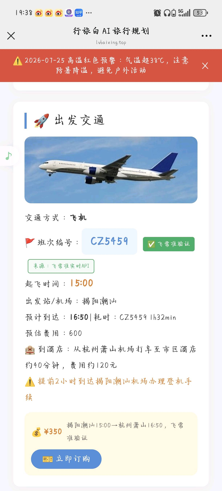

# 行旅白 — AI 旅行攻略生成器

> 输入目的地和天数，AI 自动生成完整旅行攻略——每日行程、实时天气、航班查询、酒店推荐、门票建议。**真实可用，已上线。**

---

## 📱 产品截图

### 主页 — 输入旅行需求

输入目的地、日期、预算、人数、节奏、兴趣爱好、出行方式，AI 一键生成攻略。

### 单日详情 — 海洋公园 + 自由活动

景点时段（13:30-16:00 海洋公园）、坐标、推荐理由，支持需预约提醒。

### 出发交通 — 航班详情

真实航班号（CZ5459）、起飞时间、机场、票价，全部经飞常准 API 实时验证。

---

## ✨ 功能特性

| 功能 | 说明 |
|------|------|
| 🤖 AI 行程规划 | DeepSeek 大模型生成多日详细行程，JSON 结构化输出 |
| 🗺️ 真实景点数据 | 高德地图 POI 搜索，按评分智能排序，拒绝 AI 编造 |
| 🌤️ 实时天气 | 高德天气 + 中国天气智能体，含极端天气预警 |
| ✈️ 交通规划 | 飞常准航班查询 + 高德路线规划，支持自驾/高铁/飞机 |
| 🏨 酒店门票 | AI 推荐住宿和门票预订方案 |
| 📸 真实图片 | 景点/酒店自动匹配真实图片 |
| 📱 微信小程序 | 原生小程序前端，地图总览 + 行程分享 |
| 🔄 智能重生成 | 不满意可调整节奏/人数/预算重新生成 |

---

## 🏗️ 架构

```
用户(微信小程序) → Nginx(HTTPS) → FastAPI(后端)
                                      │
              ┌───────────────────────┼───────────────────────┐
              ↓                       ↓                       ↓
        高德地图 API             DeepSeek API             飞常准 API
        (POI/天气/路线)          (行程生成/推荐)          (航班查询)
              │                       │                       │
              └───────────────────────┼───────────────────────┘
                                      ↓
                              中国天气智能体 + Wikimedia
```

### 后端模块（12 个服务）

| 模块 | 职责 |
|------|------|
| `main.py` | FastAPI 路由 + 业务编排 |
| `deepseek_service.py` | AI 行程生成 + Prompt 工程 |
| `amap_service.py` | 高德地图 POI/天气/路线/地理编码 |
| `feichangzhun_service.py` | 飞常准航班查询 + 机场白名单校验 |
| `route_service.py` | 高德路线规划（自驾/高铁/飞机） |
| `weather_detail_service.py` | 中国天气智能体详情 |
| `image_service.py` / `image_search_service.py` | 景点和酒店图片匹配 |

---

## 🛠️ 技术栈

| 层级 | 技术 | 用途 |
|------|------|------|
| 前端 | 微信小程序原生 | 用户界面、地图展示、行程分享 |
| 后端 | FastAPI + Uvicorn | 异步 API 服务 |
| 网络 | httpx (async) | 异步 HTTP，多 API 并发调用 |
| 校验 | Pydantic | 请求体类型校验 |
| AI | DeepSeek API | 行程生成、订票推荐、景点介绍 |
| 地图 | 高德地图 API | POI 搜索、天气、路线规划 |
| 航班 | 飞常准 API | 真实航班/火车班次查询 |
| 天气 | 中国天气智能体 | 实时天气、空气质量、预警 |
| 部署 | Nginx + systemd + Let's Encrypt | HTTPS 反向代理 + 进程守护 |

---

## 🔧 核心亮点

### Prompt 工程
- JSON Schema 约束强制结构化输出
- 高德 POI 评分 + 天气 + 航班数据全部注入 Prompt
- 节奏滑块 0-100 自适应调整每日景点密度
- 1 人独行到 8 人团建，行程自动适配

### 机场安全三层防护
防止 AI 编造已关闭机场（如北京南苑 2019 年关闭）：
1. Prompt 注入 42 个运营机场白名单 + 9 个停用机场黑名单
2. 后处理 `_validate_transport_airports()` 校验输出
3. 黑名单精确匹配 + 白名单校验 + 自动修正

### 异步并发 + 超时保护
```python
# POI 搜索和天气查询并行执行
poi_results = await asyncio.gather(*poi_tasks)
weather_data = await weather_task

# 图片获取不阻塞主流程
await asyncio.wait_for(fill_images(trip_data, dest), timeout=25.0)
```

### 生产级部署
- HTTPS（Let's Encrypt 免费证书）
- Nginx 反向代理（`proxy_read_timeout: 600s`）
- systemd 进程守护（崩溃自动重启）
- SSH 密钥免密部署
- `.env.example` 环境变量模板

---

## 🚀 快速开始

### 环境要求
- Python 3.10+
- 微信开发者工具

### 后端
```bash
cd backend
pip install -r requirements.txt
cp ../deploy/.env.example .env
# 编辑 .env 填入 API Key
uvicorn main:app --host 0.0.0.0 --port 8000 --reload
```

### 前端
```
微信开发者工具 → 导入 miniprogram/ → 修改后端地址
```

### 生产部署
```bash
cd deploy && chmod +x deploy.sh && sudo bash deploy.sh
certbot --nginx -d lvbaixing.top
```

---

## 📝 开发历程（132 commits）

| 时间 | 里程碑 |
|------|------|
| 2026.07 上旬 | 初版上线，基础行程生成 |
| 2026.07 中旬 | 模块化重构，后端拆为 12 个服务 |
| 2026.07 中旬 | 飞常准航班 + 中转优化 + 混合交通方式 |
| 2026.07 中旬 | 机场黑名单三层安全防护 |
| 2026.07 中旬 | HTTPS + systemd + Nginx 生产部署 |
| 2026.07 下旬 | 酒店推荐 + 天气预警 + 人数/预算/节奏自适应 |
| 2026.07 下旬 | 行程分享 + 手机浏览器兼容 + GPS 降级 |

---

## 👤 作者

**chenyt-Indom** — 准大一，广州民航职业技术学院 人工智能技术应用专业

---

## 📄 License

MIT
